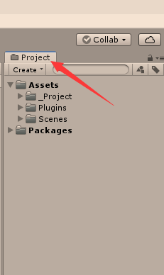
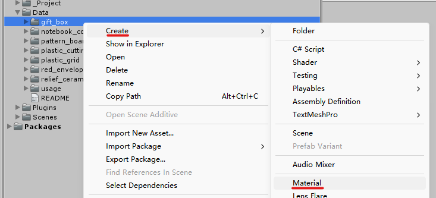
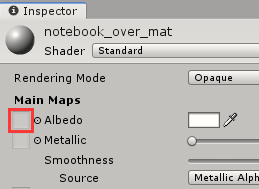
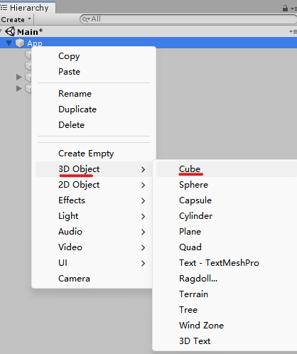
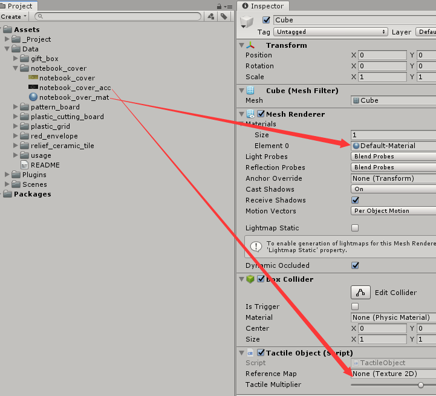

# Introduction
This README is intended to describe how to use the Pixel2Taxel dataset in [V-Touching](https://github.com/wmtlab/V-Touching).

# Usage for V-Touching (In Unity)
1. First, launch Unity and open the project directory `TouchMaterialServer`. The project interface will be displayed in Unity.

2. Drag the directory `Data` into the "Project" column:
   <div align="center">
       
   </div>

3. Create a *Material* for the desired data within the `Data` directory. Let's take **notebook_cover** as an example. Right-click on **notebook_cover**, select ```Create->Material```, and give it a custom name (let's name it **notebook_over_mat**):
   <div align="center">
       
   </div>

4. Left-click on **notebook_over_mat** to display its information in the "Inspector" column. Then, select **notebook_over** and drag it into the left rectangle box of the "Albedo" text:
   <div align="center">
       
   </div>

5. Right-click on "App" in the "Hierarchy" column and select ```3D Object->Cube``` to create a *Cube*:
   <div align="center">
       
   </div>

6. Left-click on the newly created *Cube*, click on **Add Component** at the bottom of the "Inspector" column, scroll down, then find and click on ```Scripts->TouchMaterial.Server->Tactile Object.```

7. Finally, drag **notebook_over_mat** and **notebook_over_acc** to the positions indicated by the arrows in the following image:
   <div align="center">
       
   </div>

8. enjoy it !
